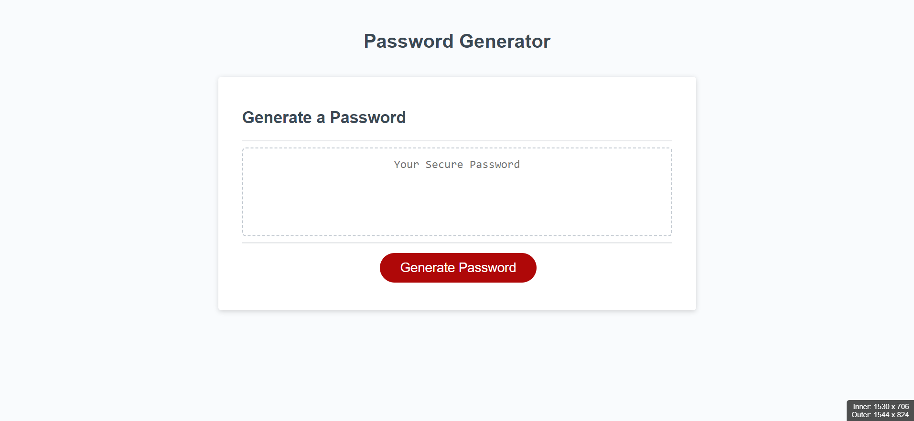

# Password Generator

## Description

This application generates a password based on the users options such as the length of the password and which type of characters they would like to use.  It has been built using a combination of HTML, CSS and Javascript.

Nowadays it can be a little difficult trying to choose a password that is secure as a lot of websites have certain conditions and these can vary from site to site, some require special characters for example, but not all of them require this.  So a password generator will come in handy when a user wants a secure password without having to think of one.

The biggest challenge in this project was working out how to get the characters from the arrays based on the users choices of what characters to use.

The first idea I had was to put the four arrays into another array. Then using an if statement to see what options the user picked and splice the arrays out that the user didn't want.  This worked fine as long as the user picked three of the four options, but if they picked less options the splicing didn't work correctly.  I also found this approach made the code complicated and not so easy to read.

After thinking about it for a long time, I took a break and the answer came to me.  Check the users options in an if statement as I had already done but concatenate the arrays the user wanted into a new array, where the random characters could be selected from.

A feature I would like to add would be a Copy button, so the user can simply click the button, the password would be copied and the user can simply paste it wherever it needs to go.  It's simple but makes the users experience a little easier.

I would also like to make a form on the page, so that instead of using prompts and confirms the user can type in straight on the page how many characters they want and tickboxes for the character options.

## Table of Contents

- [Installation](#installation)
- [Usage](#usage)
- [Credits](#credits)
- [License](#license)

##  Installation

The Password Generator project can be found by following this link: [Password Generator](https://nickmbk.github.io/password-generator/)

## Usage

Once the page has loaded the page will display a Password Generator with a text field and a Generate Password button.

When the user clicks the Generate Password button the user will be prompted to enter how many characters are required in their password.  This number must be between 10 and 64, otherwise a password will not be generated.

Once the user enters a number between 10 and 64, a series of questions will be presented asking which types of characters are required in the password.  The options presented to the user will be for lower case characters, upper case characters, numerical characters and special characters, respectively. 

The newly generated password will now display in the text field.

The user can highlight the password using the mouse and copy the password by right clicking on the highlighted text and clicking copy, or by pressing Ctrl + C.  The password can then be pasted wherever it needs to be used by right clicking where it needs to go and clicking Paste, or left click the area it needs to go and pressing Ctrl + V.

If the user declines all of the character options a password will not be generated.

The user can click on the Generate Password as many times as they like to generate a password.

## Credits

Resources that I used for this project were two MDN Reference pages, one for concatenating arrays to check the correct syntax and the page about Objects.

[Array.prototype.concat() - MDN](https://developer.mozilla.org/en-US/docs/Web/JavaScript/Reference/Global_Objects/Array/concat)

[Object - MDN](https://developer.mozilla.org/en-US/docs/Web/JavaScript/Reference/Global_Objects/Object)

## License

I used no license for this project.